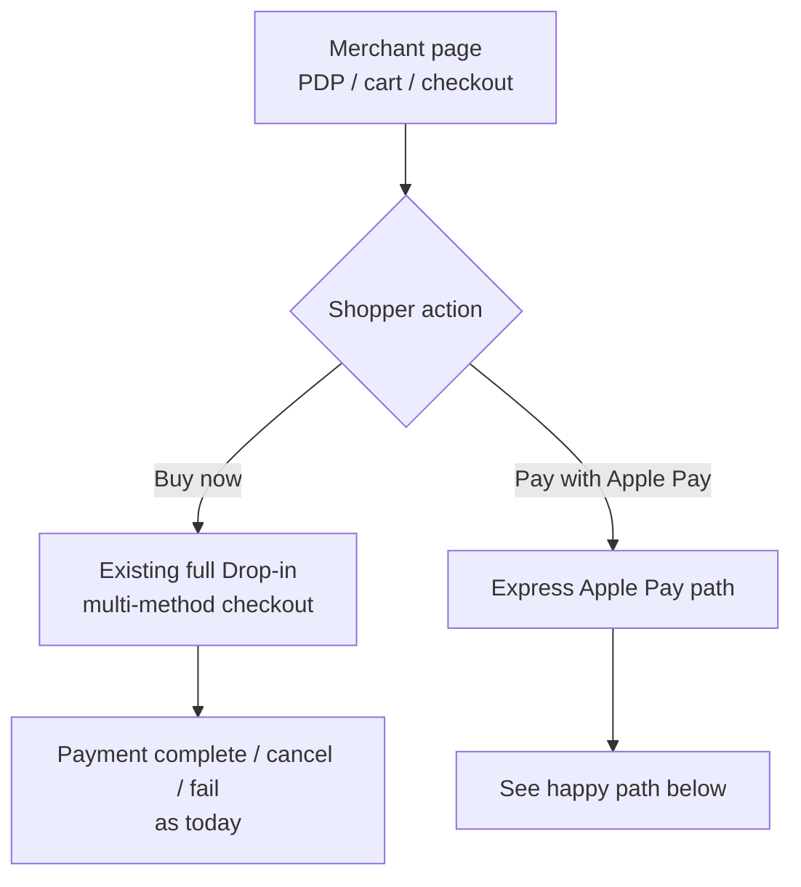
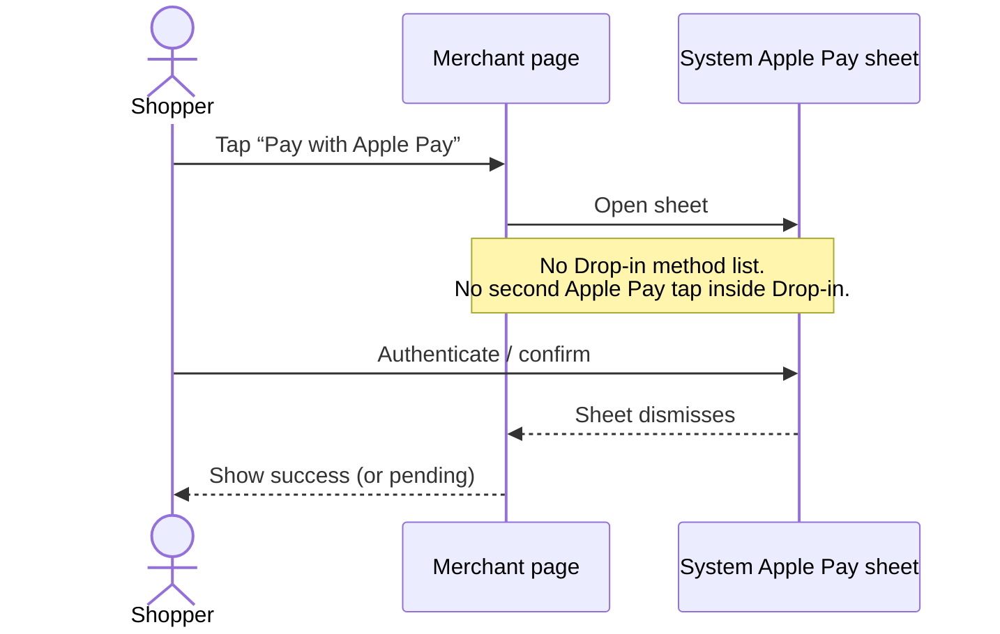
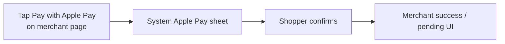
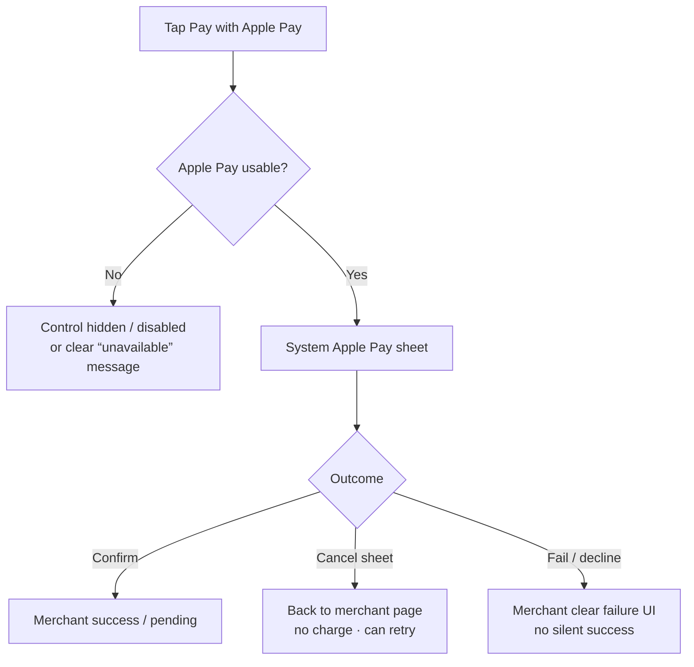
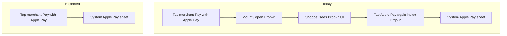

# Requirements: Drop-in Express Apple Pay — Expected UX

| Field | Value |
|-------|--------|
| Status | Draft |
| Date | 2026-08-10 |
| Audience | Evonet Drop-in product / engineering |
| Type | UX / product requirement (no implementation prescription) |

---

## 1. Intent

Merchants want shoppers to start **Apple Pay from the merchant’s own page** (for example under Buy now), and go **straight into the system Apple Pay sheet** — without opening Drop-in’s payment-method list or asking the shopper to pick Apple Pay inside Drop-in.

---

## 2. Expected UX (target)

### 2.1 Where it appears

On the merchant site (PDP, cart, or checkout), next to or under the normal purchase CTA:

```text
┌─────────────────────────────────────┐
│  Product / cart summary             │
│                                     │
│  [ Buy now ]                        │
│  [ Pay with Apple Pay ]             │  ← merchant-owned control
└─────────────────────────────────────┘
```

- **Buy now** → existing full Drop-in (or current multi-method checkout). Unchanged.
- **Pay with Apple Pay** → express path described below.

### 2.2 Entry: Buy now vs Pay with Apple Pay



### 2.3 Happy path (shopper)





There is **no** intermediate Drop-in screen where the shopper:

- browses cards / APMs / wallets, or  
- must tap a second Apple Pay button inside Drop-in.

### 2.4 Cancel / fail / unavailable



### 2.5 What the shopper should **not** see on the express path

- Full Drop-in method list  
- “Select payment method” step  
- A second “Pay with Apple Pay” only inside Drop-in after already tapping the merchant button  
- Unnecessary full-page Drop-in chrome whose only purpose is to host that second button  

(Full Drop-in UI remains valid for **Buy now** / multi-method checkout.)

---

## 3. Contrast with current UX

### Today vs expected



The requirement is this **UX gap**: one merchant tap → system sheet, with Evonet still powering Apple Pay payment completion behind the scenes.

---

## 4. Scope of the ask (product-level)

- Support the expected UX above for merchants who already use (or will use) Drop-in for payments.
- Keep behaviour for existing full Drop-in checkout available and unchanged when express is not used.
- Express Apple Pay outcomes (success / fail / cancel) should be something the merchant can handle in the same way they already handle Drop-in Apple Pay results (events, return URL, webhooks — whichever Drop-in already uses).

How Drop-in implements this (SDK API, session flags, headless host, etc.) is **out of scope for this document**.

---

## 5. Acceptance (UX)

1. Eligible shopper taps merchant **Pay with Apple Pay** → system Apple Pay sheet opens without a Drop-in method-selection step.
2. Confirming in the sheet completes payment and returns the shopper to a clear success state on the merchant side.
3. Cancelling the sheet returns the shopper to the merchant page without a completed payment.
4. Multi-method Drop-in via Buy now (or equivalent) still works as today.
5. When Apple Pay cannot run, the experience fails clearly (hidden/disabled control or explicit message), not with an empty Drop-in shell.

---

## 6. Known platform limits (context only)

Apple Pay still requires HTTPS, domain verification, eligible device/browser, and merchant Apple Pay enablement. Those constraints apply to the expected UX; they do not change the target flow above.
